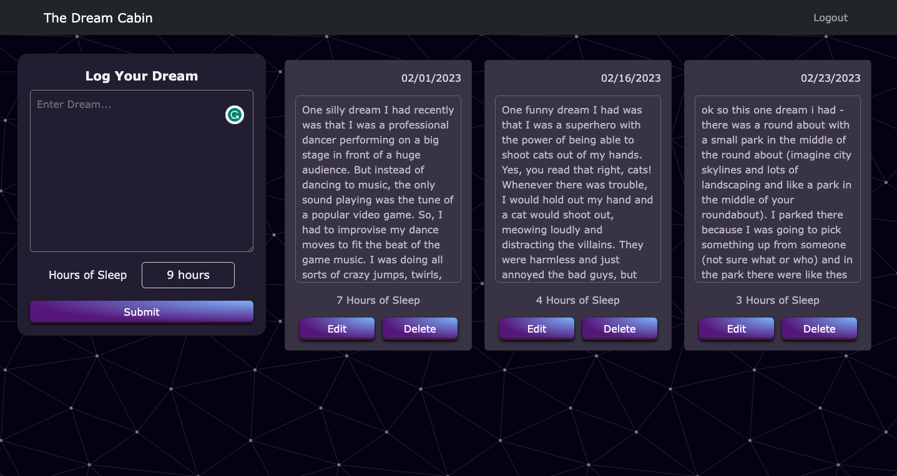
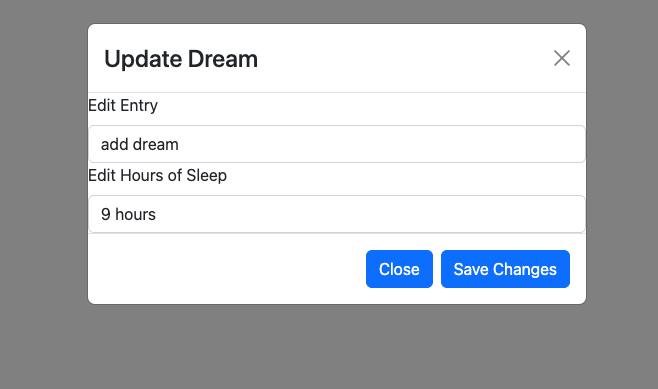
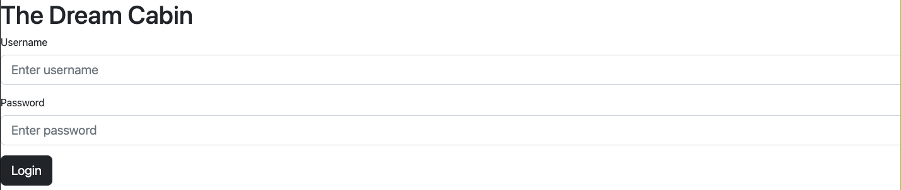

# Dream Journal App

## Introduction:
What it does:
- tracks dream journal entries
- logs hours of sleep

The Dream Cabin is a place to log down all your dreams, as we often quickly forget them upon waking up. This application features a submission form, complete with an entry field and a dropdown menu to list the hours of sleep for that night. 

## Technologies Used:
Figma, Trello

MongoDB, Express, React, Node.js

Axios, Bootstrap, React-Bootstrap, React-router-dom

## Link To Project Plan:

Trello: https://trello.com/b/MunyiOUS/the-dream-cabin

## Deployment

Link: https://dashboard.render.com/static/srv-cfdfblha6gdja6bfpak0/events

## Unsolved Problems:
- Needs better styling, it's purely functional at this point

## Future Enhancements:
- quantify the sleep quality
- authorization & authentication 
- better styling

## Biggest Challenges
- frontend update function was SUPER difficult
- Front end routing is hard.
- Deploying the frontend was difficult due to casing issue.
- React is hard. period.

## Biggest Takeaways
- I finally understand how the front end fetches data from the backend on a conceptual level
- I am finally feeling more confident when it comes to CSS positioning using Flexbox.

## Authors & Contributors

Author: Natalia Kostka

- Khang for saving my code multiple times
- Bailey, Ying, & Cynthia for help w/ troubleshooting
- Lorivie for an excellent example of the Trello project board
- Will for keeping me sane and providing much needed comedic relief
